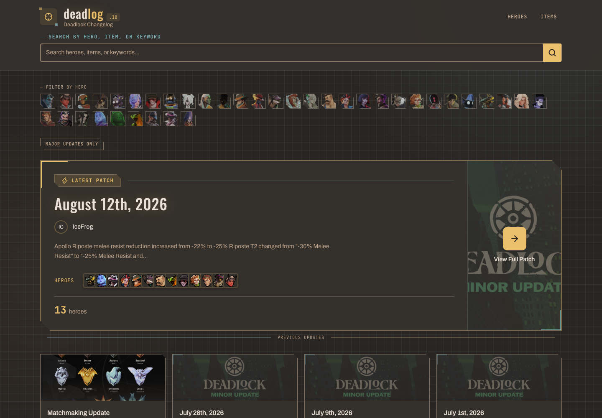

# deadlog.io

A changelog site for Deadlock

[](https://deadlog.io)

## Tech Stack

- Drizzle ORM
  - SQLite (`@libsql/client`)
  - Cloudflare D1 (`drizzle-orm/d1`)
- PNPM
- SvelteKit
- UnoCSS
- TypeScript
- Playwright
- [Deadlock API](https://deadlock-api.com)

## Development

### Project Structure

This is a pnpm workspace with the following structure:

```
apps/
  web/       # SvelteKit app
libs/
  scraper/   # Scraper & database builder
  meta/      # Meta preview image generation library
```

### Set up

```bash
# Enable direnv
direnv allow

# Install dependencies
pnpm install

# Run local dev server
pnpm dev

# Refresh the README screenshot (prod)
pnpm screenshot

# Screenshot local instead
SCREENSHOT_URL=http://127.0.0.1:5173 pnpm screenshot

# Format
nix fmt

# Check
pnpm check
```
